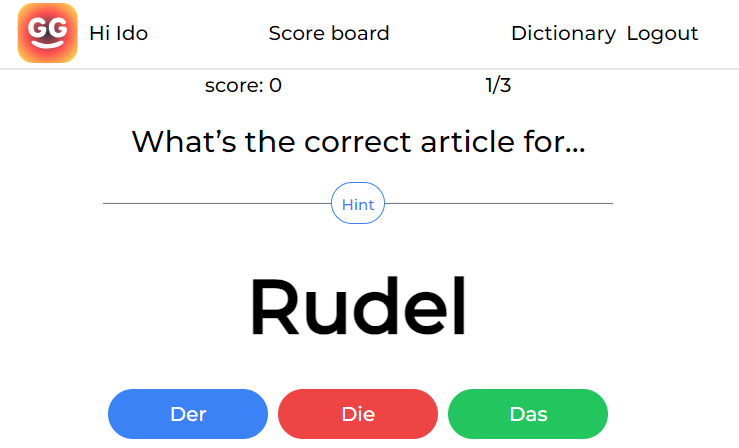

# Reporting View - Software Challenge

## Live Demo

Check out the live demo [here](https://resplendent-cactus-79b384.netlify.app/).

## Technologies Used

- **React**: For its component-based architecture.
- **TypeScript**: For improved code quality and maintainability.
- **Redux Toolkit**: Managed application state efficiently while allowing it to scale up in the future.
- **Tailwind**: For a dynamic styling.
- **Vite**: A fast build tool for development.
- **Vitest**: Testing framework used for comprehensive testing of the application.

## todos:

- [x] Create the end of the game screen.
- [x] Update all tailwind css to be more responsive
- [x] replace useContext and useReducer with Redux
- [x] Add google auth
- [ ] Add testing with Vitest
- [ ] Add high score screen with all of the high scores from the database
- [ ] Add SSR
- [ ] Add the option to add a new words to the database
- [ ] Add an option to remove words / to hide words that you know well
- [ ] Convert to a PWA
